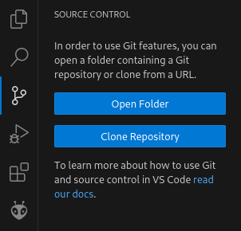

# Compile with Visual Studio Code

## Step by Step

1. [Download](https://git-scm.com/downloads/){target=_blank} and install Git.
2. Install [Visual Studio Code](https://code.visualstudio.com/download){target=_blank} (vscode).
3. In vscode, install the [PlatformIO
   Extension](https://marketplace.visualstudio.com/items?itemName=platformio.platformio-ide){target=_blank}.
4. {align=right}
   Clone the source code repository. Select the `Source Control` tab on the
   left, click `Clone Repository`, and enter the URL
   `https://github.com/helgeerbe/OpenDTU-OnBattery`. You really have to clone
   the source code repository. Do not download and extract a source ZIP file.
   During the build process the Git hash is embedded into the firmware. If you
   merely download and extract the source ZIP file a build error will occur, as
   no Git status can be determined.
5. Mandatory: [Build the WebApp](compile_webapp.md) **before** compiling the firmware.
6. Adjust the upload and monitoring port to your system by clicking the plug
   icon in vscode's bottom statusbar and selecting the respective serial port.
   
7. Unless you want to compile the default firmware variant, select the
   appropriate PlatformIO environment in vscode's bottom statusbar.
   
8. Click the arrow button in vscode's bottom status bar (PlatformIO: Upload) to
   compile and upload the firmware. During the compilation, all required
   libraries are downloaded automatically.

## Troubleshooting

In Linux, if the upload fails with error messages "Could not open /dev/ttyUSB0,
the port doesn't exist", you can check via ```ls -la /dev/tty*``` to which
group your port belongs to, and then add your username to this group via ```sudo
adduser <yourusername> dialout``` (if you are using ```arch-linux``` use:
```sudo gpasswd -a <yourusername> uucp```; this method requires a logout/login
of the affected user).

## Videos

There are two videos showing these steps (possibly not including [building the
WebApp](compile_webapp.md)):

* [Git Clone and compilation](https://youtu.be/9cA_esv3zeA){target=_blank}
* [Full installation and compilation](https://youtu.be/xs6TqHn7QWM){target=_blank}
