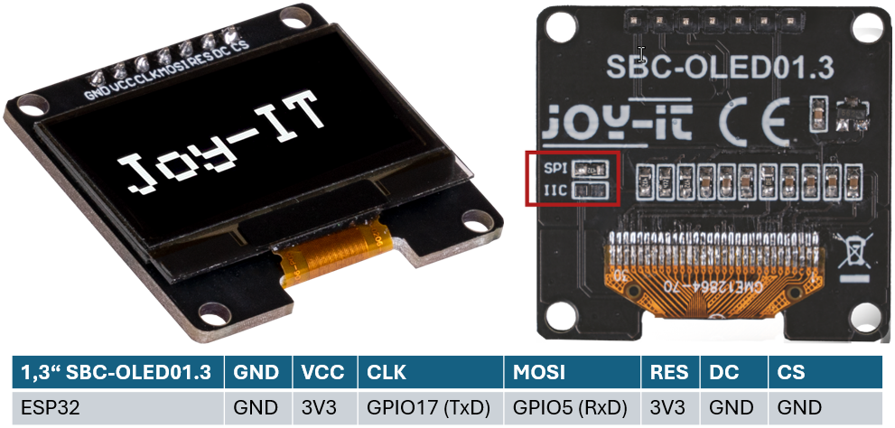

# Displays

OpenDTU currently supports different types of displays (see below). Currently only displays with a resolution of 128x64 pixel are supported. To activate a display you have to specify it's type and pin assignment either in a device profile. Please see [here](../firmware/device_profiles.md#implemented-configuration-values) for value `display.type` to determine the possible values. (On this page is also a link to several example configurations for different ESP boards)

## Display Settings

Display settings can also be found in the [Device Manager](../firmware/configuration/device_settings.md).

## Supported Models

### LCD Display PCD8544

* Size: 2,7"
* Resolution: 84x48 pixel
* Supported bus: SPI
* Type = 1

    {width=300}

### OLED Display SSD1306

* Size: 0,96"
* Resolution: 128x64 pixel
* Supported bus: I²C
* Type = 2

    {width=300}

### OLED Display SH1106

* Size: 1,3"
* Resolution: 128x64 pixel
* Supported bus: I²C
* Type = 3

    {width=300}

* Size: 1,3"
* Resolution: 128x64 pixel
* Supported bus: I²C (Jumper modification/soldering on PCB SPI => I2C/IIC is necessary)
* Type = 3

    {width=300}

### OLED Display SSD1309

* Size: 2,42"
* Resolution: 128x64 pixel
* Supported bus: I²C
* Type = 4

    {width=300}

### LCD Display ST7567S GM12864-59N

* Size: 2,1"
* Resolution: 128x64 pixel
* Supported bus: I²C
* Type = 5
* Datasheet: [link](../assets/datasheets/st7567s_gm12864-59n.webp){target=_blank}

    {width=300}

!!! note "Note"

    Due to the schematic of the display, it is not possible to turn off the backlight.
