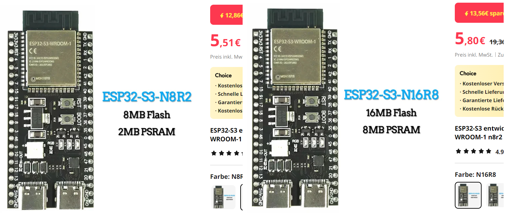

# ESP32 Module Recommendations

## Flash Memory

Due to the growing size of the firmware binaries, an ESP32 module with at least
8 MB is required to be able to use OTA updates. You may run OpenDTU-OnBattery
on ESP32 boards with only 4 MB of flash memory, but you will have to update the
firmware on these boards using the USB connection, i.e., physical access is
required.

## ESP32 vs. ESP32-S3

You should prefer an ESP32-S3 (note the "S3"). The ESP32-S3 has more GPIOs (not
all may be pinned out) and a slightly more efficient core. More importantly, it
has native USB support, freeing one hardware UART.

Make sure that the board, to which the ESP32-S3 is soldered, actually uses the
native USB capability, such that the third hardware UART becomes available.
Look out for a USB to UART transceiver. If there is one on the board, the chip
is possibly not connected natively to the USB port. There are boards with two
USB connectors, where one does connect natively to the ESP32. In that case, the
board is fine.

!!!warning "ESP32-S3 Reserved Pins"
    Modules with 8 MB of PSRAM or 16 MB or more of flash memory use an octal
    SPI interface. On these modules, pins GPIO 35, 36, and 37, which are
    usually wired to the DevKit board's pin header, are in use for the internal
    communication between ESP32-S3 and SPI flash/PSRAM memory. Thus these pins
    are **not** available for external use, even though they are wired to the
    DevKit board's pin header.

| Name                    | Flash | PSRAM | Antenna   |
| ----------------------- | ----- | ----- | --------- |
| ESP32-S3-WROOM-1U-N16R8 | 16 MB |  8 MB | external  |
| ESP32-S3-WROOM-1-N16R8  | 16 MB |  8 MB | PCB Trace |
| ESP32-S3-WROOM-1U-N16R2 | 16 MB |  2 MB | external  |
| ESP32-S3-WROOM-1-N16R2  | 16 MB |  2 MB | PCB Trace |
| ESP32-S3-WROOM-1U-N16   | 16 MB |   -   | external  |
| ESP32-S3-WROOM-1-N16    | 16 MB |   -   | PCB Trace |
| ESP32-S3-WROOM-1U-N8R8  |  8 MB |  8 MB | external  |
| ESP32-S3-WROOM-1-N8R8   |  8 MB |  8 MB | PCB Trace |
| ESP32-S3-WROOM-1U-N8R2  |  8 MB |  2 MB | external  |
| ESP32-S3-WROOM-1-N8R2   |  8 MB |  2 MB | PCB Trace |
| ESP32-S3-WROOM-1U-N8    |  8 MB |   -   | external  |
| ESP32-S3-WROOM-1-N8     |  8 MB |   -   | PCB Trace |

You will not be able to leverage 16 MB of flash memory with OpenDTU-OnBattery
any time soon. However, given the price difference, you might want to go for a
version with 16 MB, allowing the module/board to be reused in a different
project eventually.

